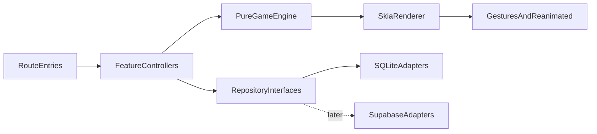

# Puzzled technical direction

## Status

This document records the foundation decision for the first mobile release. The app targets Android
and iOS, starts with a curated puzzle library, and remains fully playable without an account or
network connection.

The current milestone includes a playable Skia board: Home → Game, drag pieces from a tray, snap on
drop, and complete a 4×4 starter puzzle (`First Light`). Use a development build
(`npm run android` or EAS development APK) to judge look and feel. Persistence sync and denser
8–10 boards come next.

## Decision: Expo React Native

Puzzled will use Expo, React Native, and TypeScript.

Native Android with Kotlin would be a strong choice for an Android-only game, but it does not meet
our two-platform requirement by itself. Shipping iOS would require a separate Swift implementation
of the UI, game renderer, persistence, and tests. That cost is not justified for a 64–100 piece
casual puzzle board.

Expo is not a web wrapper. It produces native Android and iOS applications and supports custom
native code when necessary. React Native's New Architecture, Hermes, and a Skia-backed canvas give
us an appropriate performance path while retaining one product codebase. If profiling eventually
finds a platform-specific bottleneck, an Expo module can be written in Kotlin or Swift without
rewriting the application.

The trade-offs are:

- We must verify every native dependency against the active Expo SDK.
- App-store builds require native development builds rather than treating Expo Go as the production
  environment.
- iOS simulator and local iOS builds require macOS/Xcode. From Windows, physical iOS builds can be
  produced with EAS Build.
- A single canvas and UI-thread gesture values require more deliberate architecture than rendering
  every puzzle piece as a normal React Native view.

References:

- [Expo New Architecture guide](https://docs.expo.dev/guides/new-architecture/)
- [Expo Router](https://docs.expo.dev/router/introduction/)
- [React Native Skia gestures](https://shopify.github.io/react-native-skia/docs/animations/gestures/)
- [Expo SQLite](https://docs.expo.dev/versions/latest/sdk/sqlite/)
- [Expo local-first guide](https://docs.expo.dev/guides/local-first/)

## Technology stack

- **Expo SDK 57 / React Native / TypeScript:** application runtime and shared Android/iOS code.
- **Expo Router:** file-based, typed navigation. The current Expo template locates routes under
  `src/app`.
- **React Native Skia:** one accelerated canvas for the board, image clipping, piece outlines,
  shadows, and completion effects.
- **React Native Gesture Handler:** native gesture recognition around the board.
- **React Native Reanimated:** UI-thread piece transforms and snapping animations. High-frequency
  drag coordinates must not be stored in React state.
- **Expo SQLite:** durable local sessions and progress. WAL mode is enabled by the repository.
- **Jest with jest-expo:** pure game-engine unit tests and later component integration tests.
- **ESLint, TypeScript, and Prettier:** static quality gates.

Dependencies should be added through `npx expo install` when an Expo-compatible native version is
required. Versions are locked in `package-lock.json`; this document describes responsibilities, not
a second version manifest.

## Repository boundaries

```text
src/
  app/                 Route entry points only
  features/
    home/              Home presentation and progress orchestration
    game/              Game presentation and board orchestration
  game-engine/
    core/              Platform-independent geometry, rules, and session state
    rendering/         Future Skia path/image rendering
    interaction/       Future gestures, hit testing, and drag controller
  data/
    local/             Bundled catalog and SQLite implementations
    repositories.ts    Interfaces consumed by features
  shared/              Theme and cross-feature primitives
```

Dependency direction is one way:



Rules:

1. Route files parse route parameters and render feature screens; they do not contain business
   logic.
2. `game-engine/core` cannot import React, React Native, Skia, SQLite, or Supabase.
3. Features depend on repository interfaces, not concrete cloud services.
4. Rendering owns visual paths; the engine owns deterministic edge data and solved positions.
5. Only meaningful transitions cross from UI-thread interaction into durable session state.

## Jigsaw engine design

### Do not split the source bitmap

Generating and storing 64–100 image files would duplicate decoding work, complicate caching, and
make resolution changes harder. Each piece will instead render the same decoded source image:

1. Build a closed Skia path for the piece silhouette.
2. Clip the canvas to that path.
3. translate the full image by the negative source-cell origin.
4. Apply the piece's current board transform to the clipped result.

The source image is decoded once, paths are generated once per puzzle revision, and piece transforms
can change independently.

### Deterministic geometry

A puzzle is identified by `puzzleId`, `revision`, `gridSize`, and `seed`. Generation will:

1. Fit the source image with an explicit crop policy and calculate equal source cells.
2. Give all outer edges the flat value `0`.
3. Generate only each cell's right and bottom interior edge from a seeded pseudo-random generator.
4. Assign the neighboring left or top edge the exact inverse value. A tab (`1`) therefore always
   meets a blank (`-1`).
5. Derive a stable piece ID from row and column.
6. Build a local path from normalized cubic curves, scaled by the cell dimensions.

The seed and algorithm version make regeneration testable and keep saved sessions small. A generator
algorithm change requires a puzzle revision bump; old sessions must continue to use their recorded
revision.

### Coordinate systems

- **Image space:** source pixels used to select the correct part of the image.
- **Piece-local space:** origin around one grid cell, including tab overhang.
- **Board space:** solved positions and current piece positions in logical points.
- **Screen space:** board space after viewport scale and pan transforms.

Conversions will live in pure functions and be unit tested. Persisted positions use normalized board
coordinates, not raw screen pixels, so rotation and different device sizes do not invalidate saves.

### Initial layout and interaction

For 8×8, 9×9, and 10×10 boards, loose pieces should be placed in a tray or staged scatter region,
not rendered as 100 independent React view trees. The board will render pieces in one Skia canvas.

The interaction controller will:

1. Select the topmost unlocked piece under the pointer.
2. Raise its logical z-order.
3. Update translation using Reanimated shared values on the UI thread.
4. On release, compare its anchor with the solved position.
5. If inside the snap radius, animate to the exact solved transform and lock it.
6. Otherwise keep it at the released legal position.
7. Commit the drop or snap event to the serializable `GameSession`.

Hit testing can begin with transform-mirrored gesture overlays, as recommended by Skia's gesture
documentation. If profiling shows that 100 overlays are expensive, it can move to reverse-z path
containment without changing engine state.

Rotation is represented in the contracts but should remain disabled in the first playable milestone.
That keeps touch targets and snap behavior simple while preserving a future feature path.

### Completion

Completion occurs when every piece is locked. The engine records `completedAt`, final `elapsedMs`,
and status `completed` in one transition. Visual celebration is a renderer concern and cannot delay
the durable save.

## State and persistence

There are three state speeds:

- **Per-frame:** active translation, scale, and animation progress in Reanimated shared values.
- **Per-action:** active piece, z-order, lock events, timer checkpoints, and status in the game
  controller.
- **Durable:** a serializable `GameSession` saved to SQLite after meaningful actions and when the app
  backgrounds.

SQLite is the source of truth for local progress. React state is a projection of the current session,
not the database. The `ProgressRepository` isolates SQL and allows a cloud-aware implementation
later.

The session record includes stable puzzle and piece IDs, puzzle revision, normalized transforms,
elapsed time, timestamps, and sync state. Save operations use an upsert keyed by puzzle ID. Future
schema changes must use numbered migrations rather than destructive recreation.

## Backend direction

No backend is required for the local-first milestone. When accounts and cross-device sync become a
product requirement, use Supabase:

- **Auth** for optional user accounts.
- **Postgres** for puzzle metadata and user progress.
- **Storage** for curated original images and thumbnails.
- **Edge Functions** only for trusted work such as entitlement checks or image ingestion; normal
  progress CRUD can use the generated API with Row Level Security.

A likely cloud model is:

- `puzzles`: public metadata, revision, dimensions, difficulty, and publication state.
- `puzzle_assets`: storage object paths and variants tied to a puzzle revision.
- `user_puzzle_progress`: one row per user and puzzle with session payload, completion data,
  client-updated timestamp, and server revision.

Every exposed table must have RLS enabled. Public users may read only published puzzle metadata.
Authenticated users may read and write only their own progress rows. The mobile app may contain the
Supabase URL and publishable key, but must never contain a secret or `service_role` key.

Sync will be explicit:

1. Local actions save immediately and mark the session `pending`.
2. A background-capable sync service uploads pending records when authenticated and online.
3. Server acknowledgements mark them `synced`.
4. Conflicts compare puzzle revision and update timestamps. For the first sync release, the newest
   complete action history wins; completion must never be downgraded by an older in-progress save.

The repository interface prevents screens and engine rules from depending on this policy.

References:

- [Supabase with Expo](https://docs.expo.dev/guides/using-supabase/)
- [Supabase Expo quickstart](https://supabase.com/docs/guides/getting-started/quickstarts/expo-react-native)

## Performance requirements

The acceptance target is responsive 60 FPS dragging on representative mid-range Android and iOS
devices with a 10×10 puzzle.

Engineering constraints:

- No React `setState` call on each drag frame.
- Decode and reuse one source image per active puzzle.
- Memoize piece paths and gesture objects.
- Precompute geometry outside render and avoid allocations in worklets.
- Draw the board in one Skia canvas; avoid one React component tree per bitmap fragment.
- Keep shadows and blur effects bounded and profile them on Android.
- Save on drops, snaps, timer checkpoints, and app backgrounding—not continuously.
- Use release-mode development builds for performance measurements; Expo Go and debug timings are
  not acceptance evidence.
- Measure frame time, JS/UI thread stalls, startup, image decode memory, and save latency at 64, 81,
  and 100 pieces.

Initial budgets:

- Drag input should visually respond in the next rendered frame.
- A normal session save should complete without blocking interaction.
- Returning to a saved board should require one image decode and one geometry reconstruction.
- The app must remain usable offline after curated assets have been bundled or cached.

## Delivery roadmap

### 1. Foundation

- Expo Router application, Home and Game shells.
- Engine and repository contracts.
- SQLite progress adapter and quality scripts.
- This technical decision record.

### 2. Pure game engine

- Seeded complementary edge generation.
- Piece-local path command generation.
- Board/image coordinate conversion.
- Initial tray/scatter layout, snap rules, completion reducer, and exhaustive unit tests.
- Status: implemented under `src/game-engine/core`.

### 3. Playable board

- Skia image clipping and piece rendering.
- Gesture selection, drag, z-order, snapping, and locked-piece rendering.
- Timer, pause/resume, background saves, accessibility alternatives, and device profiling.

### 4. Local product experience

- Curated image assets and thumbnails.
- Real Home progress, resume/reset flows, completion history, difficulty selection, and settings.
- SQLite migrations and cache lifecycle.

### 5. Cloud services

- Supabase project and migrations, RLS policies, Storage buckets, Auth, repository adapter, and
  deterministic sync/conflict tests.
- Cloud features remain optional; offline play continues to work.

## Dependency collaboration

Multiple developers will share this repository. Keep dependency changes boring and checkable:

1. Commit `package-lock.json` with every dependency change.
2. Install Expo-compatible packages with `npx expo install <package>` only.
3. Prefer `npm ci` after pulling so everyone materializes the same tree.
4. Run `npm run deps:check` (`expo install --check` + Expo Doctor) before merging dependency PRs.
5. If a machine has stale Metro/native state after a pull, run `npm run clean:caches` then `npm ci`.
6. Do not commit `node_modules`, `.expo`, generated `dist`, or secret `.env` files.

Node.js must be `>=22.13.0` to match Expo SDK 57.

## Commands

```bash
npm ci
npm start
npm run android
npm run typecheck
npm run lint
npm test
npm run format:check
npm run doctor
npm run deps:check
npm run clean:caches
```

Use `npx expo install <package>` for Expo native packages. Use an Expo development build before
shipping or evaluating native performance.
